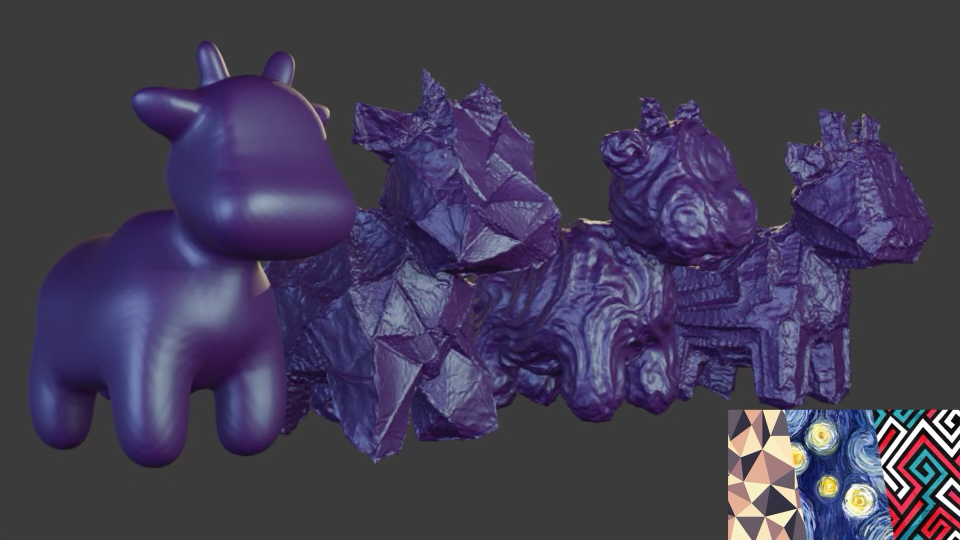
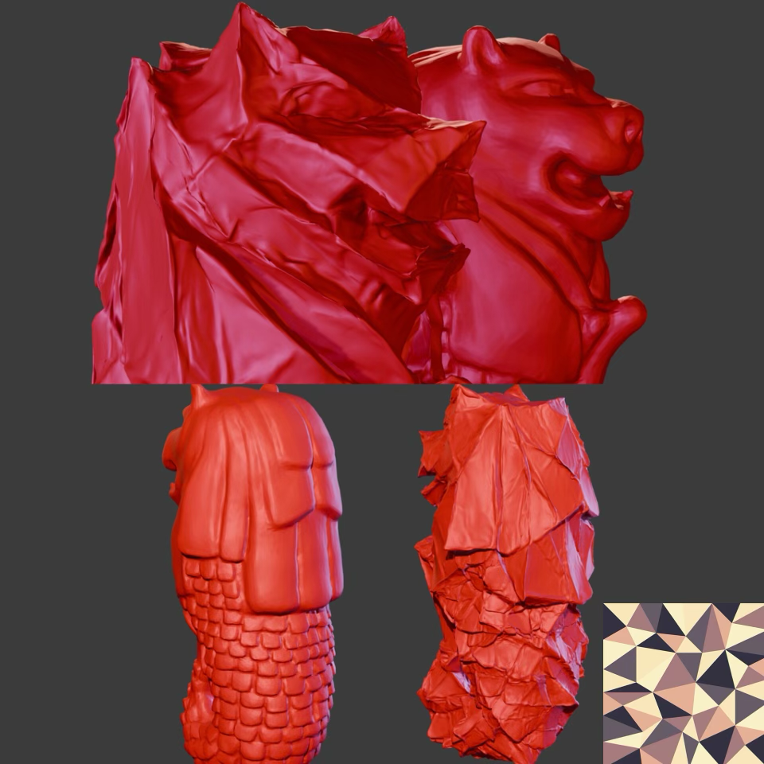

# Controllable Neural Style Transfer for Dynamic Meshes

Here's an implementation of [Controllable Neural Style Transfer for Dynamic Meshes](https://studios.disneyresearch.com/2024/07/28/controllable-neural-style-transfer-for-dynamic-meshes/) by Haetinger et al. Note that this only supports static meshes without colorization (for now).

<p align="center">
    
</p>
<p align="center">Original version of <a href=https://www.cs.cmu.edu/~kmcrane/Projects/ModelRepository>Spot</a> on the left with styles appearing in their respective order.</p>

TL;DR—this jitters 3D vertices to minimize the MSE between early layer activations of VGG16 from reference style image and ones extracted from images produced by a differentiable renderer.

## Usage
1. Clone repo and place an .obj file to ```data/``` and a style image in ```data/styles``` (anywhere really is fine)
2. Change corresponding paths in the `main` of `model/transfer.py` and run:
```bash
python model/transfer.py
```
3. (Optional) finetune the learning rate, number of iterations per smoothness level, smoothness factors, and masking ratios as needed. The original paper offers starting points for these.

## Implementation Notes
- I used a compute cluster with 1x A100 40Gb. The original paper used an RTX 3090.
- ```spot_280k.obj``` with the given parameters takes ~4 minutes to optimize, but takes the authors 2 minutes, so hyperparameter selection + setup difference likely explains this. 
- Poisson sampling is not *truly* Poisson
- Cholesky factoring and solving uses ```scikit-sparse``` with a custom backwards pass for the latter, but the lower triangular factor is not guaranteed to be sparse. Still, a dense Laplacian-Beltrami matrix for a 200k vertex mesh at fp32 is over 120 Gb!

<p align="center">
    
</p>
<p align="center"><a href=https://skfb.ly/6tNNG>Original merlion</a></p>

### Dependencies
I'll make a ```requirements.txt``` later, but for now...
- Pytorch
- Pytorch3D
- scipy
- scikit-sparse

### Future TODOs

I think a few READMEs say "I'll come back to it" but especially this one has a bit more work to do to make it anywhere close to the outputs on the paper.

- Debug to pipeline to smoothen meshes (outputs are VERY wrinkly) and better transfer style at lower Laplacian coefficients
- Add support for dynamic meshes
- Add support for optimizing vertex colors